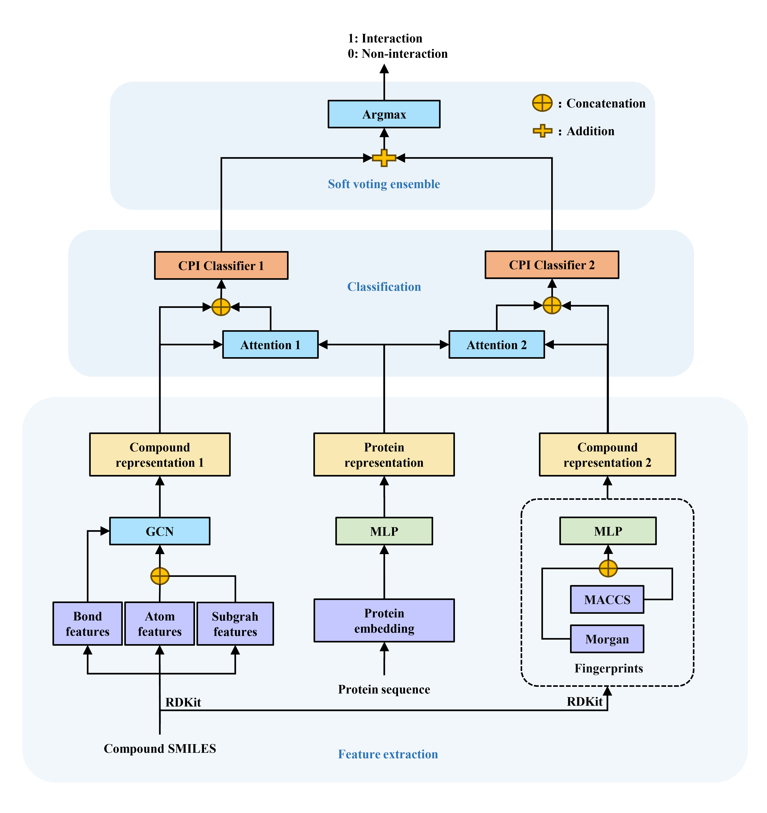

# SVCPI: a soft voting ensemble-based model for compound–protein interaction prediction

We focus on establishing a high-performance model for compound-protein interaction prediction. A soft voting ensemble -based framework SVCPI was proposed to improve the model robustness and generalizability. SVCPI employed a soft voting algorithm to combine two basic classifiers that rely on GCN features and molecular fingerprint features. Upon tests on five data sets, SVCPI demonstrated an excellent predictive performance and outperforms recently reported deep learning models.

<div align="center">
<p></p>
</div>

## Characteristics

- This code is easy to use. After setting the environment (e.g., PyTorch),
preprocessing data and learning a model can be done by just run python train.py cfg.json.
- If you prepared a CPI dataset with the same format as provided in the dataset directory,
you can train your own model with your dataset.


## Requirements

- Python 3.7.11
- PyTorch 1.10.0
- RDKit 2022.09.5
- scikit-learn 1.3.0


## Usage

We provide two major scripts:

- create_dataset.py creates the input data for processing with PyTorch from the original data
(see data/human/data.txt or data/celegans/data.txt).
- train.py trains the model using the above preprocessed data
(see data/human/data.pkl or data/celegans/data.pkl).

(i) Create the data of CPIs with the following command:
```
python create_dataset.py --dd datadir
```

The preprocessed data are saved in the datadir/data.pkl file.

(ii) Create a json file which describes the hyperparameters and dataset of a training job:

```
{
  "max_epochs": 21,
  "batch_size": 16,
  "n_filters_list": [
    16,
    256,
    32,
    128
  ],
  "mlp_layers": 3,
  "readout_layers": 1,
  "n_head": 2,
  "dim": 128,
  "bias": true,
  "shuffle_idx": false,
  "datadir": "data/human",
  "nfold": 5,
  "fp_linear_layers": 2,
  "model_path": "None",
  "split_index_path": "data/human/split_index.pkl",
  "save_dir": "data/human/result",
  "seed": 9555
}
```

(iii) Using the preprocessed data, train the model with the following command:
```
python train.py cfg.json
```

The training and test results and the model are saved in the save_dir/xxx described in the cfg.json file
(after training, see save_dir/xxx. A new directory will be generated for each training).

## Training a new model using your own CPI dataset
In the directory of data/human or data/celegan,
we now have the original data "data.txt" as follows:

```
smiles protein activity
CC[C@@]...OC)O MSPLNQ...KAS 0
C1C...O1 MSTSSL...FLL 1
CCCC(=O)...CC=C1 MAGAGP...QET 0
...
...
...
CC...C MKGNST...FVS 0
C(C...O)N MSPSPT...LCS 1
```

Each line has "smiles protein activity"
Note that, the interaction 1 means that "the pair of SMILES and sequence has interaction" and
0 means that "the pair does not have interaction."

Note that you can also make a directory named "data.txt" and put data files "train.txt", "dev.txt"
and "test.txt" (optional) with the format described above. As such, the data spliting will follow
your files. 

If you prepared a dataset with the same format as "data.txt" in a new directory
(e.g., data/yourdata/data.txt),
you can train your own model using your dataset following the above commands (i) to (iii).
